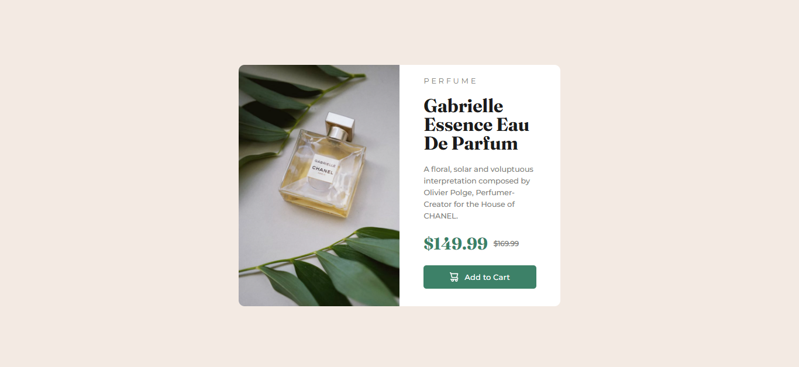

# Frontend Mentor - Product preview card component

This is a solution to the [Product preview card component on Frontend Mentor](https://www.frontendmentor.io/challenges/product-preview-card-component-GO7UmttRfa).  
Frontend Mentor challenges help you improve your coding skills by building realistic projects.

---

## 📸 Screenshot

---

## 🔗 Links

- **Solution URL:** [https://www.frontendmentor.io/challenges/product-preview-card-component-GO7UmttRfa?tab=report](#)
- **Live Site URL:** [https://fransantos103.github.io/frontendMentorEasy-Product-preview-card-component/](#)

---

## 💻 My process
    ### Built with
- Semantic **HTML5** markup  
- **CSS3** (Flexbox, hover states, custom fonts)  
- Responsive design principles  

---

## 🧠 What I learned

While working on this project, I reinforced my understanding of:
- Using **semantic HTML** (`<main>`)
- Creating **centered layouts** with Flexbox  
- Designing **consistent color palettes and hover effects**

Here’s a little code snippet I’m proud of:

I'm proud of the media queries, even though I believe I still have a lot to learn about media queries

@media (max-width: 450px) {
main {
    flex-direction: column;
    width: 85%;
    overflow: hidden;
  }

.chanelPerfume {
    width: 100%;
    height: 280px;
    object-fit: cover;
    border-bottom-left-radius: 0px; 
    border-top-left-radius: 10px; 
    border-top-right-radius: 10px;
    content: url("images/image-product-mobile.jpg");
  }

.perfume{
    width: 100%;
    margin-left: 15%;
    margin-top: 15px;
    font-size: 0.8em;
}

h1{
    width: 60%;
    margin-left: 15%;
    margin-top: 5px;
    margin-bottom: 0px;
    line-height: 30px;
    font-size: 1.4rem;
}

.description{
    font-size: 0.8em;
    line-height: 20px;
    width: 70%;
    margin-left: 15%;
    margin-top: 2%;
}

h2{
    gap: 10px;
    width: 100%;
    margin-left: 15%;
    margin-top: 2%;
}

.actualPrice{
    font-size: 1em;
}

.oldPrice{
    font-family: 'Montserrat-Regular';
    color: #7e7e80;
    font-size: 0.5em;
}

button{
    width: 70%;
    margin-left: 15%;
    margin-top:5%;
    margin-bottom: 5%;
    padding-bottom: 12px;
    padding-top: 12px;
}

}

@media (max-width: 320px) {
main {
    flex-direction: column;
    width: 90%;
    overflow: hidden;
    height: 95%;
  }

.chanelPerfume {
    width: 100%;
    height: 190px;
    object-fit: cover;
    object-position: center;
    border-bottom-left-radius: 0px; 
    border-top-left-radius: 10px; 
    border-top-right-radius: 10px;
    content: url("images/image-product-mobile.jpg");
  }

.perfume{
    width: 100%;
    margin-left: 15%;
    margin-top: 10px;
    font-size: 0.6em;
}

h1{
    width: 60%;
    margin-left: 15%;
    margin-top: 5px;
    margin-bottom: 0px;
    line-height: 25px;
    font-size: 1.2rem;
}

.description{
    font-size: 0.6em;
    line-height: 20px;
    width: 70%;
    margin-left: 15%;
    margin-top: 2%;
}

h2{
    gap: 10px;
    width: 100%;
    margin-left: 15%;
    margin-top: 1%;
}

.actualPrice{
    font-size: 0.7em;
}

.oldPrice{
    font-family: 'Montserrat-Regular';
    color: #7e7e80;
    font-size: 0.3em;
}

button{
    width: 70%;
    margin-left: 15%;
    margin-top: 3%;
    margin-bottom: 5%;
    padding-bottom: 9px;
    padding-top: 9px;
}

}
